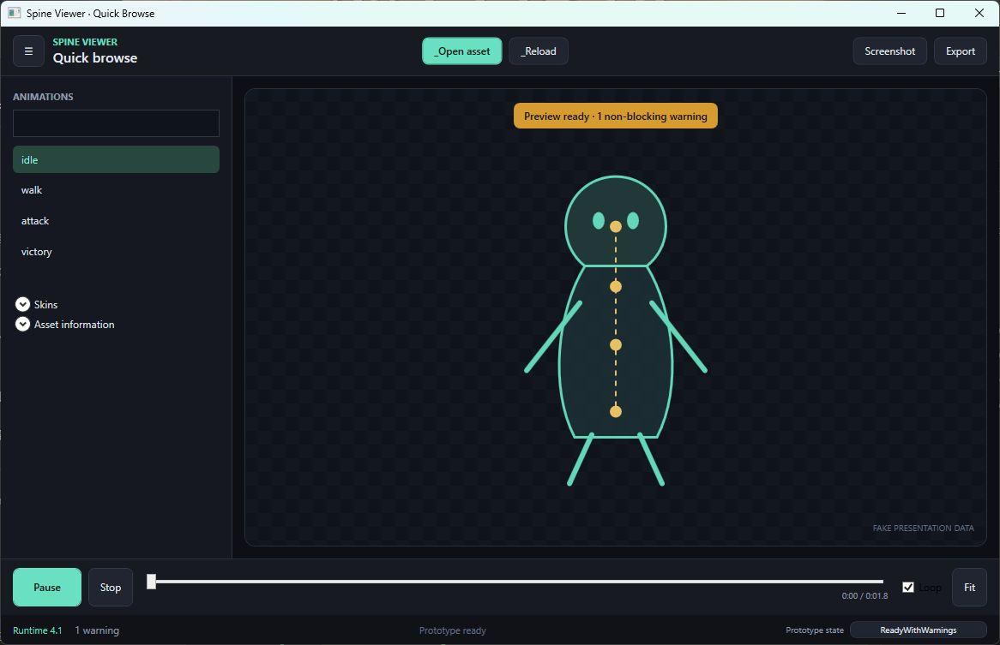
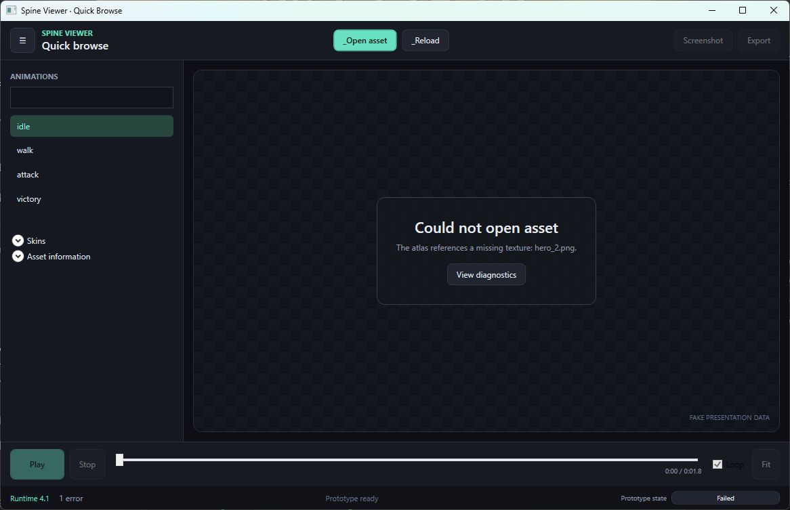
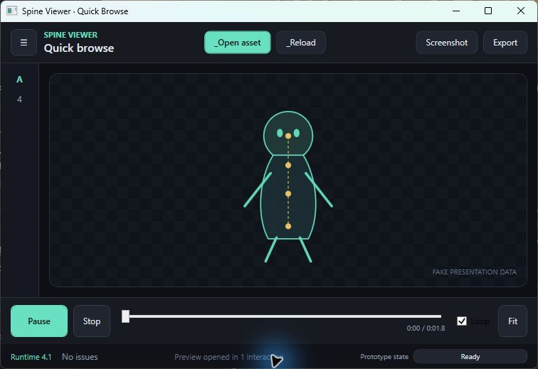

# TASK-002 Quick-Browse Prototype Review

## v2 Workflow Annotation

Verified v2 requires a settings/open window before preview:

```text
File menu → Open window → choose atlas → choose skeleton
→ choose one of 14 Runtimes → enter canvas size → confirm → preview
```

This is at least six user decisions after invoking Open. A wrong Runtime is discovered only after parsing, and animation zero auto-plays after a successful load.

## Prototype Wireframe

```text
┌ command bar: open / reload                 screenshot / export ┐
├ browse rail ───────┬ viewport-first preview                    ┤
│ animation search   │ empty/loading/preview/blocking overlays   │
│ animation list     │                                           │
│ ▸ skins            │                                           │
│ ▸ asset details    │                                           │
├────────────────────┴ play / stop / timeline / loop / fit ──────┤
└ Runtime / diagnostics        activity        prototype state ──┘
```

At 756 by 519 pixels, the browse rail collapses to 54 pixels and the fake preview scales down without clipping.

## State Review

| State | Presentation | Primary commands |
|---|---|---|
| Empty | Drop/open call to action | Open enabled |
| Loading | Non-modal progress and dependency text | Asset commands disabled |
| Ready | Preview, selected animation, auto-play | Playback/capture/export enabled |
| ReadyWithWarnings | Preview remains visible with amber warning | Playback remains enabled |
| Unsupported | Blocking summary, Runtime, next action | Diagnostics/reload |
| Failed | Missing dependency summary and diagnostics | Reload/open |
| RendererUnavailable | Metadata retained, preview blocked | Diagnostics/reload |
| Exporting | Preview retained with progress overlay | Export/playback blocked |

## Command Map

| Command | Shortcut | Automation ID |
|---|---|---|
| Open asset | `Ctrl+O` | `Main.Command.OpenAsset` |
| Reload | `F5` | `Main.Command.Reload` |
| Export | `Ctrl+E` | `Main.Command.Export` |
| Screenshot | `Ctrl+S` | `Main.Command.Screenshot` |
| Play/pause | `Space` | `Main.Playback.Toggle` |
| Fit viewport | `F` | `Main.Viewport.Fit` |
| Diagnostics | `Ctrl+D` | `Main.Status.Diagnostics` |
| Cycle fake state | `Ctrl+Shift+D` | `Main.Prototype.StatePicker` |

The animation search/list, skin list, viewport, timeline, loop, Runtime, and diagnostics surfaces also expose the stable IDs defined in `15-ui-information-architecture.md`.

## Interaction Count

- v2 documented flow: at least six decisions after Open.
- v3 prototype: one `Ctrl+O` or Open button action from Empty to visible, fitted, auto-playing preview.
- Advanced settings are not required for the valid fake asset path.

## Screenshots

Ready with a non-blocking warning:



Blocking asset failure:



Collapsed rail at the measured 756 by 519 minimum:



## Review Result

- All required fake states rendered and were visually inspected.
- UI Automation exposed `Main.Viewport.Surface` and the primary command IDs.
- `Ctrl+O` was exercised through Windows input and reached Ready in one interaction.
- No View or ViewModel references official Runtime, renderer, or GPU types.
- ADR-004 records the auto-play and remembered-state decisions.
